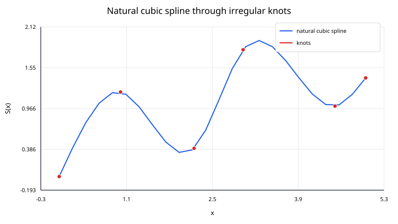
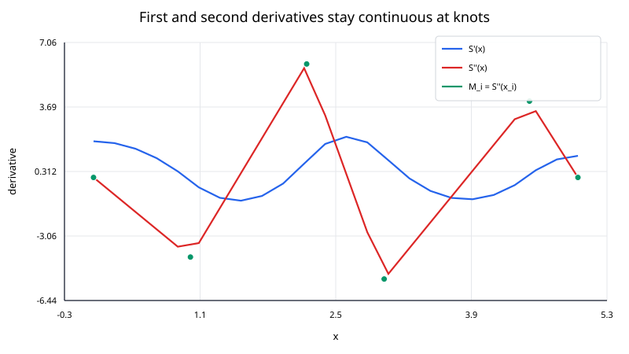

## Cubic Spline Interpolation

A cubic spline interpolates data with a sequence of cubic polynomials rather than one high-degree polynomial across the entire interval.

For ordered nodes

$$
x_0<x_1<\cdots<x_n,
$$

one cubic is used on each interval

$$
[x_i,x_{i+1}].
$$

The pieces are joined so that the function, first derivative, and second derivative are continuous at every interior knot. The result is a smooth curve with local low-degree behavior.

### Why use piecewise cubics?

A straight-line interpolant is simple and local, but it has slope discontinuities at the nodes. A single high-degree polynomial is smooth, but it can oscillate strongly and becomes increasingly sensitive as the number of nodes grows.

Cubic splines occupy a useful middle ground:

- each segment has low degree;
- the full interpolant is smooth;
- the linear system has a sparse tridiagonal structure;
- after setup, evaluating one query requires only one cubic segment.

### Segment definition

On interval $[x_i,x_{i+1}]$, write

$$
S_i(x) =
a_i+b_i(x-x_i)+c_i(x-x_i)^2+d_i(x-x_i)^3.
$$

For $n$ intervals there are $4n$ segment coefficients.

They are determined by four types of conditions.

#### 1. Interpolation

Each segment matches its endpoint values:

$$
S_i(x_i)=y_i,
\qquad
S_i(x_{i+1})=y_{i+1}.
$$

#### 2. First-derivative continuity

At an interior knot,

$$
S_{i-1}'(x_i)=S_i'(x_i).
$$

#### 3. Second-derivative continuity

Also require

$$
S_{i-1}''(x_i)=S_i''(x_i).
$$

#### 4. Two boundary conditions

The interior conditions alone do not uniquely determine the spline. Two endpoint conditions are required.

This note focuses on the **natural spline**:

$$
S''(x_0)=0,
\qquad
S''(x_n)=0.
$$

Other common choices are clamped, periodic, and not-a-knot boundary conditions.

A natural boundary condition sets the endpoint **curvature** to zero; it does not set the endpoint slope to zero.

### Solving with knot second derivatives

A convenient derivation introduces

$$
M_i=S''(x_i).
$$

Let

$$
h_i=x_{i+1}-x_i.
$$

For a natural spline,

$$
M_0=0,
\qquad
M_n=0.
$$

The interior second derivatives satisfy the tridiagonal equations

$$
h_{i-1}M_{i-1} +
2(h_{i-1}+h_i)M_i +
h_iM_{i+1} = 6
\left[
\frac{y_{i+1}-y_i}{h_i} -
\frac{y_i-y_{i-1}}{h_{i-1}}
\right]
$$

for

$$
i=1,\ldots,n-1.
$$

The right-hand side measures the change in neighboring secant slopes. If the data are locally close to a straight line, that difference is small; if the slope changes strongly, the spline needs more curvature.

### Recovering the cubic coefficients

Once the $M_i$ values are known,

$$
a_i=y_i,
$$

$$
b_i =
\frac{y_{i+1}-y_i}{h_i} -
\frac{h_i}{6}(2M_i+M_{i+1}),
$$

$$
c_i=\frac{M_i}{2},
$$

and

$$
d_i =
\frac{M_{i+1}-M_i}{6h_i}.
$$

Thus

$$
S_i(x) =
a_i+b_i\Delta x+c_i\Delta x^2+d_i\Delta x^3,
\qquad
\Delta x=x-x_i.
$$

### Why the joins are smooth

The second derivative on a segment is

$$
S_i''(x)=2c_i+6d_i(x-x_i).
$$

At the left endpoint,

$$
S_i''(x_i)=2c_i=M_i.
$$

At the right endpoint,

$$
S_i''(x_{i+1}) =
2c_i+6d_ih_i =
M_{i+1}.
$$

Adjacent segments therefore share the same second derivative at each knot. The tridiagonal system was derived from the matching of the first derivatives, so those are continuous as well.

### Worked example

Use

$$
(0,0),\qquad(1,0.5),\qquad(2,0).
$$

Both intervals have width

$$
h_0=h_1=1.
$$

For a natural spline,

$$
M_0=M_2=0.
$$

The only interior equation is

$$
1\cdot M_0 +
2(1+1)M_1 +
1\cdot M_2 = 6
\left[
\frac{0-0.5}{1} -
\frac{0.5-0}{1}
\right].
$$

Therefore,

$$
4M_1=-6,
$$

so

$$
M_1=-1.5.
$$

For the first interval,

$$
a_0=0,
\qquad
b_0=0.75,
\qquad
c_0=0,
\qquad
d_0=-0.25.
$$

Hence

$$
S_0(x)=0.75x-0.25x^3.
$$

At $x=0.5$,

$$
S_0(0.5) =
0.75(0.5)-0.25(0.5)^3 =
0.34375.
$$

Thus

$$
\boxed{S(0.5)=0.34375}.
$$

### Algorithm

For a natural cubic spline:

I. sort the points by increasing $x_i$;

II. compute interval widths

$$
h_i=x_{i+1}-x_i;
$$

III. assemble the tridiagonal system for $M_1,\ldots,M_{n-1}$;

IV. solve that system;

V. set $M_0=M_n=0$;

VI. compute $(a_i,b_i,c_i,d_i)$ for each interval;

VII. for each query, locate its interval and evaluate the corresponding cubic.

The Thomas algorithm solves a nonsingular tridiagonal system in $O(n)$ time and $O(n)$ storage.

### Evaluation cost

After preprocessing, a query requires:

- interval search: $O(\log n)$ with binary search;
- polynomial evaluation: constant work.

The cubic can be evaluated in nested form:

$$
S_i(x) =
a_i+\Delta x
\left[
b_i+\Delta x(c_i+\Delta x d_i)
\right].
$$

### Boundary conditions matter

Different endpoint conditions produce different interpolants even when all interior data are identical.

Common options include:

- **natural**:

$$
S''(x_0)=S''(x_n)=0;
$$

- **clamped**: prescribed endpoint slopes;
- **periodic**: endpoint values and derivatives match periodically;
- **not-a-knot**: the first two and last two cubic pieces are constrained to behave as if the first and last interior knots were not true breaks.

When comparing with a library, make sure the boundary condition matches. A library default may not be natural.

### Numerical behavior and limitations

Cubic splines usually avoid the dramatic oscillations of high-degree global polynomials, but they are not automatically shape preserving.

A cubic spline can:

- overshoot between monotone data points;
- become negative between positive samples;
- change shape globally when a data value changes because the coefficient system is coupled.

If monotonicity is required, use a shape-preserving interpolation method designed for that constraint.
