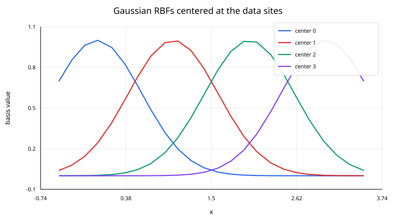
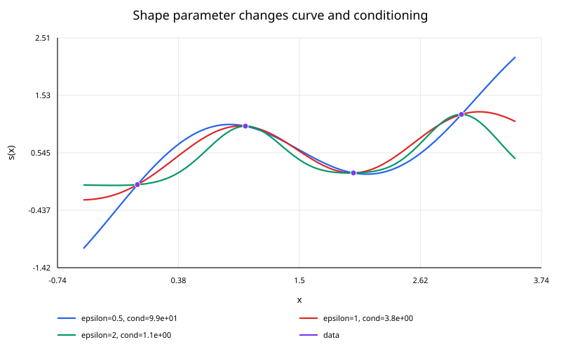

## Gaussian Radial Basis Function Interpolation

Gaussian radial basis function (RBF) interpolation builds a smooth interpolant from Gaussian functions centered at the data sites.

For one-dimensional nodes

$$
x_0,\ldots,x_n,
$$

the interpolant has the form

$$
s(x) =
\sum_{j=0}^{n}
\lambda_j
e^{-\varepsilon^2(x-x_j)^2}
$$

where the coefficients $\lambda_j$ are chosen so that

$$
s(x_i)=y_i
$$

for every data point.

Unlike piecewise splines, the representation is global: every basis function can contribute to every query.

### The Gaussian kernel

The Gaussian radial basis function is

$$
\phi(r)=e^{-(\varepsilon r)^2},
$$

with shape parameter

$$
\varepsilon>0.
$$

The distance is

$$
r=|x-x_j|.
$$

A larger $\varepsilon$ produces a narrower Gaussian. A smaller $\varepsilon$ produces a broader, flatter Gaussian.

Another common parameterization is

$$
\phi(r) =
e^{-r^2/(2\sigma^2)}.
$$

The two forms are equivalent when

$$
\varepsilon=\frac{1}{\sqrt{2}\sigma}.
$$

When reading code or papers, always check which convention is being used.

### Interpolation system

Applying the condition

$$
s(x_i)=y_i
$$

gives

$$
\sum_{j=0}^{n}
\lambda_j
e^{-\varepsilon^2(x_i-x_j)^2} =
y_i.
$$

Define the matrix

$$
A_{ij} =
e^{-\varepsilon^2(x_i-x_j)^2}.
$$

Then the coefficients satisfy

$$
A\boldsymbol{\lambda} =
\mathbf y.
$$

For distinct data sites and $\varepsilon>0$, the Gaussian kernel is strictly positive definite. In exact arithmetic, the matrix is therefore symmetric positive definite and the interpolation problem has a unique solution.

### Do not form the inverse explicitly

The mathematical identity

$$
\boldsymbol{\lambda}=A^{-1}\mathbf y
$$

is useful symbolically, but numerical code should solve the linear system directly.

For a dense symmetric positive-definite matrix, Cholesky factorization is a natural direct method. A generic dense solver is also appropriate for small examples.

Explicitly computing $A^{-1}$ usually costs more, stores more information than needed, and can amplify numerical error.

### Worked example

Use

$$
(0,0),\qquad(1,0.5),\qquad(2,0)
$$

with

$$
\varepsilon=1.
$$

Then

$$
A
=
\begin{bmatrix}
1 & e^{-1} & e^{-4}\\
e^{-1} & 1 & e^{-1}\\
e^{-4} & e^{-1} & 1
\end{bmatrix}.
$$

Numerically,

$$
A
\approx
\begin{bmatrix}
1 & 0.367879 & 0.018316\\
0.367879 & 1 & 0.367879\\
0.018316 & 0.367879 & 1
\end{bmatrix}.
$$

Solving

$$
A\boldsymbol{\lambda} =
\begin{bmatrix}
0\\0.5\\0
\end{bmatrix}
$$

gives approximately

$$
\lambda_0=-0.246025,
$$

$$
\lambda_1=0.681015,
$$

$$
\lambda_2=-0.246025.
$$

Therefore,

$$
s(x) =
-0.246025e^{-x^2} +
0.681015e^{-(x-1)^2} -
0.246025e^{-(x-2)^2}.
$$

At

$$
x=0.5,
$$

the result is approximately

$$
\boxed{s(0.5)\approx0.31284}.
$$

The interpolant still passes through all three supplied data values exactly in exact arithmetic.

### Why the shape parameter matters

The shape parameter affects both the visual shape of the interpolant and the conditioning of the linear system.

When $\varepsilon$ is large, each basis function is narrow. The interpolation matrix becomes closer to the identity if the sites are well separated.

When $\varepsilon$ is small, the basis functions are broad and increasingly similar to one another. The matrix can become severely ill-conditioned even though it remains nonsingular in exact arithmetic.

This creates a classic RBF tradeoff:

- flatter basis functions can produce excellent approximation properties;
- the corresponding coefficient solve can become numerically difficult.

The value of $\varepsilon$ should not be chosen solely by visual preference.

### Conditioning

The condition number

$$
\kappa(A)
$$

measures how sensitive the coefficient solution is to perturbations and rounding.

A large condition number means that small numerical errors in $A$ or $\mathbf y$ can lead to much larger relative changes in the computed coefficients.

A useful workflow is to inspect both:

- interpolation accuracy at the nodes;
- the condition number of the kernel matrix.

Large coefficients with heavy cancellation can be a warning sign even when the final interpolated values still look reasonable.

### Derivatives

The Gaussian interpolant is infinitely differentiable.

The first derivative is

$$
s'(x) =
\sum_{j=0}^{n}
-2\varepsilon^2(x-x_j)
\lambda_j
e^{-\varepsilon^2(x-x_j)^2}.
$$

The second derivative is

$$
s''(x) =
\sum_{j=0}^{n}
\lambda_j
\left[
4\varepsilon^4(x-x_j)^2 -
2\varepsilon^2
\right]
e^{-\varepsilon^2(x-x_j)^2}.
$$

No explicit derivative-matching equations are needed because there are no piecewise joins.

### Algorithm

I. validate that all data sites are distinct;

II. choose $\varepsilon>0$;

III. construct the dense matrix

$$
A_{ij}=e^{-\varepsilon^2(x_i-x_j)^2};
$$

IV. solve

$$
A\boldsymbol{\lambda}=\mathbf y;
$$

V. evaluate new queries with

$$
s(x)=\sum_j \lambda_j e^{-\varepsilon^2(x-x_j)^2}.
$$

### Complexity

For $N=n+1$ sites, a straightforward dense implementation requires roughly:

- $O(N^2)$ memory for the matrix;
- $O(N^3)$ work for a direct factorization;
- $O(N)$ work for one scalar query after the coefficients are known.

These costs become important for large datasets. Specialized approximations, local RBF methods, iterative solvers, or fast kernel techniques may then be needed.

### Interpolation is not smoothing

The system above enforces exact interpolation. If the data are noisy, reproducing every observation may be undesirable.

Regularized RBF fitting modifies the problem, for example by solving a system of the form

$$
(A+\alpha I)\boldsymbol{\lambda} =
\mathbf y,
$$

with $\alpha>0$.

That is no longer exact interpolation, but it can trade a small data mismatch for improved stability and smoothing.

### Higher dimensions

Gaussian RBF interpolation extends directly to points

$$
\mathbf x_j\in\mathbb R^d.
$$

Replace the one-dimensional distance by the Euclidean norm:

$$
r=\|\mathbf x-\mathbf x_j\|_2.
$$

Then

$$
s(\mathbf x) =
\sum_j
\lambda_j
e^{-\varepsilon^2\|\mathbf x-\mathbf x_j\|_2^2}.
$$

This dimension-independent form is one reason RBF interpolation is useful for scattered data.
