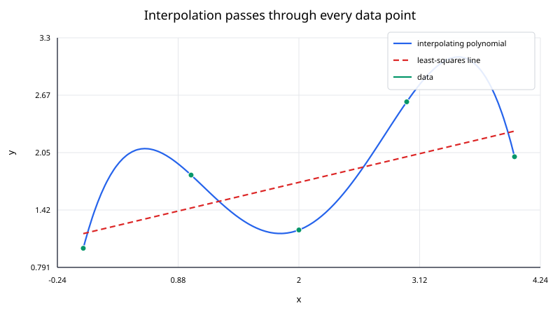
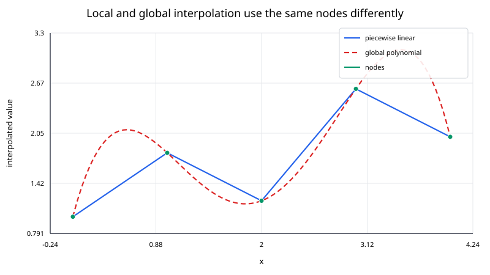

## Interpolation

Interpolation constructs a function that passes **exactly** through a set of known data points. If the data are

$$
(x_0,y_0),(x_1,y_1),\ldots,(x_n,y_n),
$$

an interpolant $p(x)$ satisfies

$$
p(x_i)=y_i,\qquad i=0,1,\ldots,n.
$$

This is different from regression or approximation. A regression model is usually allowed to miss individual observations in order to capture an overall trend; an interpolant treats the supplied values as exact constraints.

The distinction matters. If the measurements are noisy, exact interpolation may reproduce noise that should have been smoothed away. If the values come from a trusted table, simulation, or expensive deterministic function, exact interpolation can be exactly what is needed.

### What problem does interpolation solve?

Suppose a function is known only at selected locations. We want to estimate its value at a query point $x_*$ between those locations.

Typical examples include:

- values stored in a lookup table,
- sampled trajectories or sensor calibrations,
- tabulated physical properties,
- values of an expensive simulation,
- resampling data onto a different grid.

The input nodes should be distinct. In one dimension it is usually convenient to sort them so that

$$
x_0 < x_1 < \cdots < x_n.
$$

Interpolation is primarily an **in-domain** operation. Evaluating outside the range $[x_0,x_n]$ is extrapolation, which is usually less reliable because the data no longer constrain the model on both sides of the query.

### Local and global interpolants

Interpolation methods differ mainly in how much of the data they use to answer one query.

A **local** method uses only nearby points. Piecewise linear interpolation, for example, uses the two nodes surrounding the query. Cubic splines use one local polynomial segment for evaluation, although their coefficients are coupled through a global system.

A **global** method uses all data points in one formula. Lagrange interpolation, Newton interpolation, and Gaussian radial basis function interpolation are examples.

This local-versus-global distinction affects cost, smoothness, sensitivity, and how much the interpolant changes when one observation is modified.

### A simple example

Consider

$$
(0,1),\qquad (1,2),\qquad (2,0).
$$

To estimate the value at $x_*=1.5$, piecewise linear interpolation uses only the interval $[1,2]$:

$$
t=\frac{1.5-1}{2-1}=0.5.
$$

The interpolated value is

$$
p(1.5)=(1-t)\cdot 2+t\cdot 0=1.
$$

A quadratic polynomial through all three points gives a different curve between the nodes even though it reproduces the same three data values exactly. Both are valid interpolants; they encode different assumptions about the shape between observations.

### Polynomial interpolation

For $n+1$ distinct one-dimensional nodes, there is exactly one polynomial of degree at most $n$ that passes through all points.

It can be represented in several mathematically equivalent forms:

- **Lagrange form**, which expresses the polynomial as a weighted sum of cardinal basis functions;
- **Newton form**, which uses divided differences and can be extended one node at a time;
- **monomial form**, such as

$$
p(x)=a_0+a_1x+\cdots+a_nx^n,
$$

which is conceptually simple but often a poor numerical representation for solving the interpolation problem directly.

The representation matters numerically even when the underlying polynomial is the same.

### Piecewise interpolation

High-degree global polynomials can oscillate strongly, especially near the ends of an interval when nodes are equally spaced. Piecewise methods avoid fitting one large polynomial across the whole domain.

Two important examples are:

1. **Piecewise linear interpolation**: simple, local, and continuous, but the slope jumps at every interior node.
2. **Cubic spline interpolation**: piecewise cubic and usually $C^2$, so the function, first derivative, and second derivative are continuous at interior knots.

Piecewise methods are often preferable when the dataset has many nodes.

### Radial basis interpolation

Interpolation can also be built from distance-based basis functions. In one dimension, Gaussian radial basis function interpolation has the form

$$
s(x)=\sum_{j=0}^{n}\lambda_j
e^{-\varepsilon^2(x-x_j)^2}.
$$

In two dimensions, thin-plate splines use a radial kernel such as

$$
\phi(r)=r^2\log r,
$$

with the value at $r=0$ defined by continuity as $0$.

RBF methods generalize naturally to scattered multidimensional data, where there may be no convenient one-dimensional ordering of the nodes.

### Interpolation error

An interpolant reproduces the data exactly, but that does **not** imply that it reproduces the unknown function exactly between the nodes.

For polynomial interpolation through $n+1$ nodes, if the underlying function $f$ is sufficiently smooth, the error can be written as

$$
f(x)-p_n(x) =
\frac{f^{(n+1)}(\xi_x)}{(n+1)!}
\prod_{i=0}^{n}(x-x_i)
$$

for some point $\xi_x$ in the interval containing the nodes and the query.

This expression shows two sources of error:

- the smoothness and higher derivatives of the underlying function;
- the placement of the interpolation nodes.

Adding more equally spaced nodes does not automatically improve a global polynomial interpolant. Node placement and numerical stability matter.

### Numerical questions to ask

Before choosing an interpolation method, ask:

**Are the observations effectively exact?**  
If the values contain substantial measurement noise, regression or smoothing may be more appropriate.

**How smooth should the result be?**  
Piecewise linear interpolation is continuous but not differentiable at the knots. Cubic splines are smoother. Gaussian RBF interpolants are infinitely differentiable.

**Is the data one-dimensional or scattered in several dimensions?**  
Polynomial and spline methods are especially natural in one dimension. RBF methods are often convenient for scattered multidimensional data.

**Will points be added frequently?**  
Newton interpolation has an incremental form. A global solve may be less convenient if the dataset changes often.

**How many queries will be evaluated?**  
Some methods have a relatively expensive setup followed by cheap evaluations. For repeated queries, that setup can be worthwhile.

### Complexity overview

For $n+1$ nodes:

| Method | Setup | Cost per scalar query | Typical property |
|---|---:|---:|---|
| Piecewise linear | $O(n)$ preprocessing or none | $O(\log n)$ interval search | local, continuous |
| Newton polynomial | $O(n^2)$ divided differences | $O(n)$ | global polynomial |
| Lagrange polynomial | $O(n^2)$ naive setup, $O(n)$ barycentric setup | $O(n)$ | global polynomial |
| Natural cubic spline | $O(n)$ with a tridiagonal solver | $O(\log n)$ + constant evaluation | local cubic pieces, $C^2$ |
| Gaussian RBF | dense solve, typically $O(n^3)$ | $O(n)$ | global, very smooth |

The exact costs depend on implementation and whether many queries are evaluated in a batch.

### Interpolation versus extrapolation

Within the data range, nearby samples constrain the interpolant on both sides. Outside that range, the interpolant follows the assumptions of the chosen model rather than direct information from the data.

For example:

- linear interpolation becomes linear extrapolation if the end segment is extended;
- a high-degree polynomial can grow very rapidly outside the node interval;
- Gaussian RBF interpolation may decay or behave unexpectedly depending on the fitted coefficients and shape parameter;
- spline libraries differ in their default extrapolation behavior.

An implementation should make the extrapolation policy explicit rather than silently assuming that interpolation and extrapolation have the same reliability.

### Practical workflow

A robust interpolation workflow is:

1. validate that node coordinates are finite and distinct;
2. sort one-dimensional nodes when the method expects an ordered grid;
3. choose a method whose smoothness and locality match the application;
4. build the interpolant;
5. verify that the method reproduces the data points to numerical precision;
6. inspect behavior between the nodes;
7. define an explicit policy for out-of-range queries;
8. compare against a trusted library implementation for important applications.

