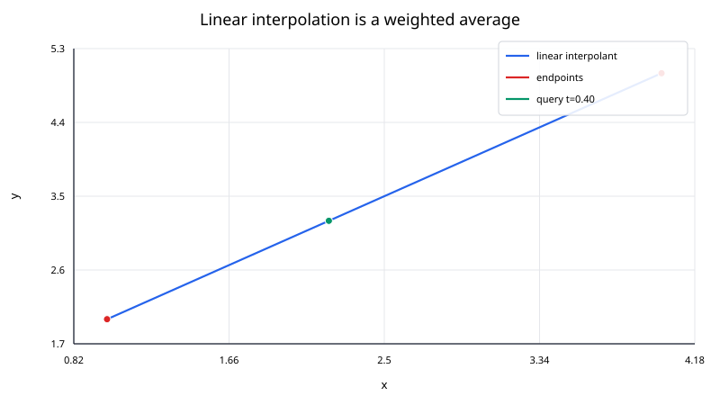
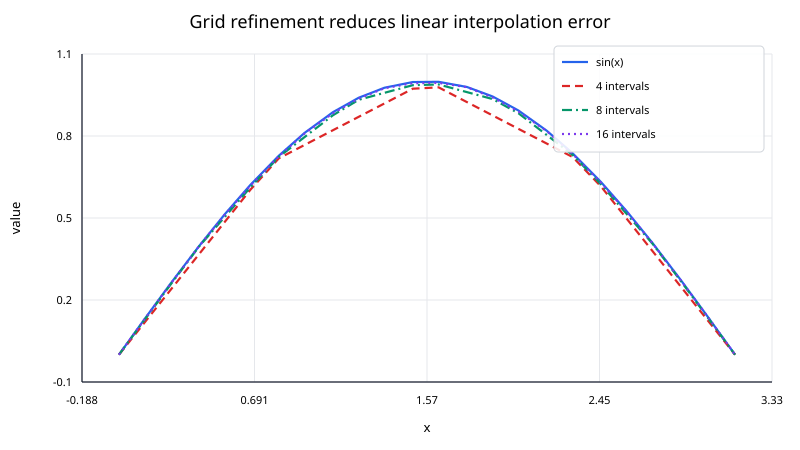

## Linear Interpolation

Linear interpolation estimates a value between two known points by assuming the function is a straight line over that interval.

Given two points

$$
(x_0,y_0),\qquad (x_1,y_1),
$$

with $x_0\ne x_1$, the interpolated value at a query $x$ is

$$
L(x) =
y_0+\frac{x-x_0}{x_1-x_0}(y_1-y_0).
$$

A particularly useful form introduces the normalized coordinate

$$
t=\frac{x-x_0}{x_1-x_0}.
$$

Then

$$
L(x)=(1-t)y_0+t y_1.
$$

When $x$ lies between the endpoints, $0\le t\le1$, so the result is a weighted average of the endpoint values.

### Geometric interpretation

The slope between the two samples is

$$
m=\frac{y_1-y_0}{x_1-x_0}.
$$

The line through $(x_0,y_0)$ is therefore

$$
L(x)=y_0+m(x-x_0).
$$

This formula is exactly the same as the weighted form above.

The weights

$$
1-t
\quad\text{and}\quad
t
$$

sum to one. That has an important consequence: if $x$ is between $x_0$ and $x_1$, then $L(x)$ lies between $y_0$ and $y_1$. A single linear segment cannot overshoot its two endpoint values.

### Worked example

Take

$$
(x_0,y_0)=(1,2),
\qquad
(x_1,y_1)=(4,5),
$$

and estimate the value at

$$
x=2.2.
$$

First compute the normalized position:

$$
t=\frac{2.2-1}{4-1}
=\frac{1.2}{3}
=0.4.
$$

Then

$$
L(2.2)
=(1-0.4)\cdot2+0.4\cdot5
=1.2+2
=3.2.
$$

So

$$
\boxed{L(2.2)=3.2}.
$$

The calculation can also be read geometrically: the query is $40\%$ of the way from $x_0$ to $x_1$, so its interpolated value is $40\%$ of the way from $y_0$ to $y_1$.

### Piecewise linear interpolation

For many ordered data points

$$
x_0<x_1<\cdots<x_n,
$$

piecewise linear interpolation applies the same two-point formula on each interval.

If

$$
x_i\le x\le x_{i+1},
$$

then

$$
L_i(x) =
y_i
+
\frac{x-x_i}{x_{i+1}-x_i}
(y_{i+1}-y_i).
$$

The resulting interpolant is continuous because adjacent segments meet at the shared data points.

However, its derivative is generally discontinuous. On interval $[x_i,x_{i+1}]$,

$$
L_i'(x)=
\frac{y_{i+1}-y_i}{x_{i+1}-x_i},
$$

which is constant on that interval. At an interior node, the slope usually jumps from one secant slope to the next.

### Why grid refinement helps

For a smooth function, shorter intervals usually make the straight-line approximation more accurate.

If $f$ is twice continuously differentiable on $[x_i,x_{i+1}]$, the interpolation error satisfies

$$
f(x)-L_i(x) =
\frac{f''(\xi_x)}{2}
(x-x_i)(x-x_{i+1})
$$

for some $\xi_x$ in the interval.

Let

$$
h_i=x_{i+1}-x_i.
$$

The product

$$
|(x-x_i)(x-x_{i+1})|
$$

is largest at the midpoint and equals $h_i^2/4$ there. Therefore,

$$
|f(x)-L_i(x)|
\le
\frac{h_i^2}{8}
\max_{\xi\in[x_i,x_{i+1}]}
|f''(\xi)|.
$$

This explains the familiar second-order behavior: if the maximum interval width is reduced by roughly a factor of two, the interpolation error for a smooth function often decreases by roughly a factor of four.

### Algorithm

For a single query in sorted data:

I. verify that the query lies in the permitted range;

II. locate the interval $[x_i,x_{i+1}]$ containing the query;

III. compute

$$
t=\frac{x-x_i}{x_{i+1}-x_i};
$$

IV. return

$$
(1-t)y_i+t y_{i+1}.
$$

A binary search locates the interval in $O(\log n)$ time. The interpolation itself is constant-time work.

For many sorted queries, a single pass through the nodes and queries can avoid repeating binary searches.

### Numerical details

The formula

$$
y_i+t(y_{i+1}-y_i)
$$

is often preferable in code to separately constructing a slope and intercept. It works directly with the local interval and keeps the calculation compact.

Important checks include:

- reject duplicate nodes because $x_{i+1}-x_i=0$ would cause division by zero;
- decide how to handle a query exactly equal to a node;
- decide whether to clamp, reject, or extrapolate out-of-range queries;
- use a data type with sufficient precision for the scale of the coordinates.

When $x_i$ and $x_{i+1}$ are extremely large but very close together relative to machine precision, the difference $x_{i+1}-x_i$ can lose relative accuracy. Rescaling or shifting the coordinate system can help.

### Extrapolation

If $x$ lies outside $[x_i,x_{i+1}]$, the same formula still produces a number, but then either

$$
t<0
\qquad\text{or}\qquad
t>1.
$$

The weights are no longer both between zero and one, and the result is linear extrapolation rather than interpolation.

Extrapolation can be reasonable over a short distance when a linear trend is justified, but it should not be treated as automatically reliable.

### Advantages

Linear interpolation is attractive because it is:

- simple to derive and implement;
- local;
- inexpensive;
- exact at the nodes;
- free from overshoot inside each interval;
- easy to update when new nodes are added.

### Limitations

Its main limitation is smoothness. The interpolant is only piecewise linear, so corners appear at most interior nodes. If derivatives are important, a cubic spline or another smooth method may be a better choice.

Linear interpolation also ignores curvature inside an interval. A long interval over a highly curved function can produce a noticeable error even though the endpoint values are exact.
