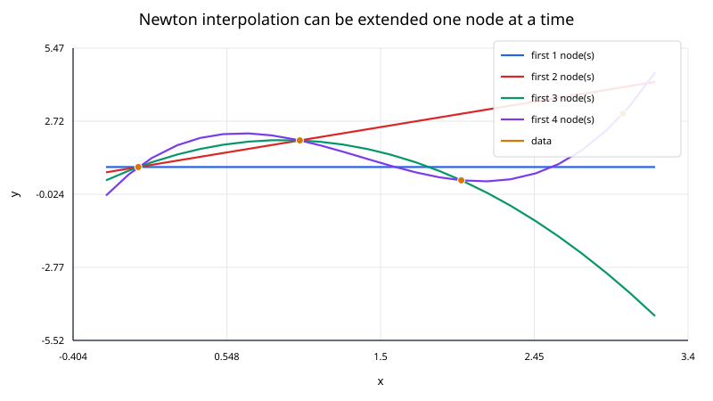
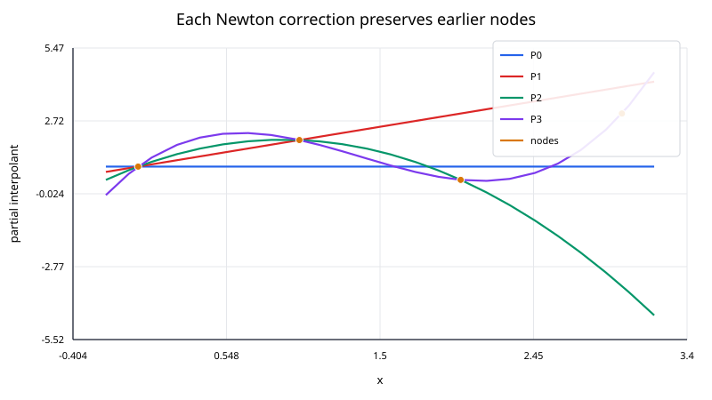

## Newton Polynomial Interpolation

Newton interpolation represents the same unique polynomial obtained by Lagrange interpolation, but in a form that is easier to build incrementally.

For distinct nodes

$$
x_0,x_1,\ldots,x_n,
$$

the Newton polynomial is

$$
P_n(x) =
a_0
+a_1(x-x_0)
+a_2(x-x_0)(x-x_1)
+\cdots
+a_n\prod_{j=0}^{n-1}(x-x_j).
$$

The coefficients $a_k$ are **divided differences**.

The key advantage is structural: when a new point is added, the previously computed terms do not need to be changed. One new coefficient and one new product term are appended.



### Divided differences

The zeroth-order divided differences are simply the data values:

$$
f[x_i]=y_i.
$$

First-order divided differences are secant slopes:

$$
f[x_i,x_{i+1}] =
\frac{f[x_{i+1}]-f[x_i]}{x_{i+1}-x_i}.
$$

Higher-order divided differences are defined recursively:

$$
f[x_i,\ldots,x_{i+k}] =
\frac{
f[x_{i+1},\ldots,x_{i+k}] -
f[x_i,\ldots,x_{i+k-1}]
}{
x_{i+k}-x_i
}.
$$

The Newton coefficients are the first entry in each order:

$$
a_0=f[x_0],
$$

$$
a_1=f[x_0,x_1],
$$

$$
a_2=f[x_0,x_1,x_2],
$$

and so on.

### Worked example

Use the points

$$
(0,1),\qquad(1,3),\qquad(2,2).
$$

The zeroth-order column is

$$
1,\quad3,\quad2.
$$

The first divided differences are

$$
f[x_0,x_1] =
\frac{3-1}{1-0}
=2,
$$

$$
f[x_1,x_2] =
\frac{2-3}{2-1}
=-1.
$$

The second divided difference is

$$
f[x_0,x_1,x_2] =
\frac{-1-2}{2-0} =
-\frac{3}{2}.
$$

Therefore,

$$
P_2(x) =
1
+2(x-0)
-\frac{3}{2}(x-0)(x-1).
$$

Expanding gives

$$
P_2(x) =
-\frac{3}{2}x^2
+\frac{7}{2}x
+1,
$$

which is exactly the same polynomial produced by the Lagrange form.

At $x=1.5$,

$$
P_2(1.5)=2.875.
$$

### Why the construction is incremental

Suppose $P_k(x)$ already interpolates the first $k+1$ nodes. Adding $x_{k+1}$ introduces one new term:

$$
P_{k+1}(x) =
P_k(x)
+
a_{k+1}
\prod_{j=0}^{k}(x-x_j).
$$

At any earlier node $x_i$ with $i\le k$, the new product contains the factor

$$
x_i-x_i=0.
$$

Therefore the new term vanishes at every old node. The correction can enforce the new data point without disturbing the interpolation conditions that were already satisfied.



### Divided-difference table

For implementation, the coefficients can be computed in place.

Starting from

$$
a_i\leftarrow y_i,
$$

update the array order by order:

$$
a_i
\leftarrow
\frac{a_i-a_{i-1}}{x_i-x_{i-j}}
$$

for increasing divided-difference order $j$ and appropriate indices $i$.

A full divided-difference table uses $O(n^2)$ storage, but only the coefficient diagonal is needed for evaluation. An in-place implementation can therefore reduce storage to $O(n)$.

The arithmetic cost to build all coefficients is $O(n^2)$.

### Nested evaluation

The Newton form should not be evaluated by separately computing every long product.

A nested form analogous to Horner's method is

$$
P_n(x) =
a_0
+(x-x_0)
\left[
a_1
+(x-x_1)
\left[
a_2+\cdots
+(x-x_{n-1})a_n
\right]
\right].
$$

This evaluates the polynomial in $O(n)$ operations.

One implementation pattern is:

```text
value = a_n
for k = n-1, ..., 0:
    value = a_k + (x - x_k) * value
```

### Relationship to Lagrange interpolation

For the same $n+1$ distinct nodes and values, Lagrange and Newton interpolation produce the same polynomial.

The difference is the representation:

- Lagrange form emphasizes basis functions with the cardinal property;
- Newton form emphasizes divided differences and incremental construction.

Because the underlying polynomial is identical, both forms have the same approximation error in exact arithmetic.

### Error formula

If $f$ has $n+1$ continuous derivatives, then

$$
f(x)-P_n(x) =
\frac{f^{(n+1)}(\xi_x)}{(n+1)!}
\prod_{i=0}^{n}(x-x_i)
$$

for some $\xi_x$ in the interval of interest.

As with Lagrange interpolation, high degree and poor node placement can cause large oscillations.

### Equal spacing and finite differences

When nodes are equally spaced, divided differences are closely related to finite-difference tables. This leads to classical Newton forward and backward interpolation formulas.

The general divided-difference form is more flexible because it does **not** require equal spacing.

### Numerical considerations

Newton interpolation avoids solving a Vandermonde system, but it is still a global high-degree polynomial method. Its numerical behavior can deteriorate when:

- the polynomial degree becomes large;
- the nodes are badly scaled;
- the nodes are clustered extremely close together;
- equally spaced nodes produce Runge-type oscillations.

Useful safeguards include:

- shifting and scaling the node coordinates;
- using moderate polynomial degree;
- preferring piecewise splines for large datasets;
- checking interpolation residuals at the nodes;
- comparing against a barycentric Lagrange implementation.

### Complexity

For $n+1$ points:

- coefficient construction: $O(n^2)$;
- storage: $O(n)$ for an in-place coefficient array;
- one query: $O(n)$ with nested evaluation;
- adding one new node after existing divided differences are available: $O(n)$ additional work.

This incremental update is one of Newton interpolation's main practical advantages.
