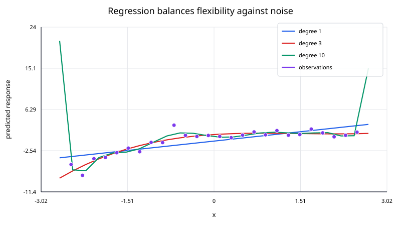
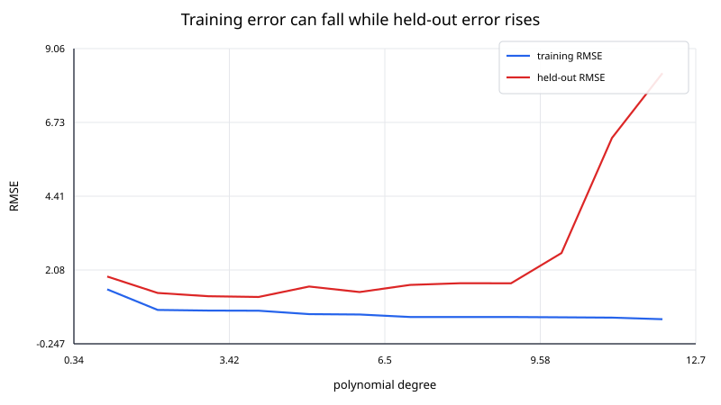

## Regression

Regression models the relationship between one or more predictors and a response variable. Unlike interpolation, regression generally does **not** try to pass exactly through every observation. Instead, it chooses model parameters that balance data fit with a chosen model structure.

For observations

$$
(\mathbf x_i,y_i),
$$

a regression model predicts

$$
\hat y_i=f(\mathbf x_i;\boldsymbol{\theta}).
$$

The parameters $\boldsymbol{\theta}$ are estimated by minimizing a loss function or maximizing a likelihood.

For ordinary least squares,

$$
\hat{\boldsymbol{\theta}} =
\underset{\boldsymbol{\theta}}{\mathrm{arg\,min}}
\;
\sum_{i=1}^{N}
\left[
y_i-f(\mathbf x_i;\boldsymbol{\theta})
\right]^2.
$$

The central question is not just “How closely can the model fit these data?” but “How well does the fitted relationship describe or predict new data?”

### Regression versus interpolation

Interpolation imposes exact constraints:

$$
p(x_i)=y_i.
$$

Regression allows residuals:

$$
r_i=y_i-\hat y_i.
$$

This difference reflects different assumptions.

Use interpolation when the supplied values should be treated as exact samples of an underlying function. Use regression when the observations contain noise, unexplained variation, or measurement error and the goal is to estimate a trend or predictive relationship.

### Linear regression

A model is called **linear regression** when it is linear in its unknown coefficients.

For one predictor,

$$
y =
\beta_0+\beta_1x+\varepsilon,
$$

where $\varepsilon$ represents unexplained variation.

For multiple predictors,

$$
y =
\beta_0
+\beta_1x_1
+\cdots
+\beta_px_p
+\varepsilon.
$$

In matrix form,

$$
\mathbf y =
X\boldsymbol{\beta}
+
\boldsymbol{\varepsilon}.
$$

Ordinary least squares estimates $\boldsymbol{\beta}$ by minimizing

$$
\mathrm{RSS}(\boldsymbol{\beta}) =
\|\mathbf y-X\boldsymbol{\beta}\|_2^2.
$$

See `least_squares.md` for the linear-algebra derivation and numerical solution methods.

### Polynomial regression is still linear regression

A polynomial model such as

$$
y =
\beta_0
+\beta_1x
+\beta_2x^2
+\beta_3x^3
+\varepsilon
$$

is nonlinear in $x$ but linear in the coefficients $\beta_j$.

The design matrix is

$$
X =
\begin{bmatrix}
1 & x_1 & x_1^2 & x_1^3\\
1 & x_2 & x_2^2 & x_2^3\\
\vdots & \vdots & \vdots & \vdots\\
1 & x_N & x_N^2 & x_N^3
\end{bmatrix}.
$$

It can therefore be fit with the same least-squares machinery as a straight line.

### Residuals

For each observation,

$$
r_i=y_i-\hat y_i.
$$

Residuals are not just leftover errors; they are diagnostic information.

A useful residual plot can reveal:

- curvature that the model failed to capture;
- changing variance;
- outliers;
- time dependence;
- groups or structure missing from the predictors.

A small average residual is not sufficient. A model can have systematic residual patterns and still have a deceptively good aggregate error metric.

### Common error metrics

The residual sum of squares is

$$
\mathrm{RSS} =
\sum_{i=1}^{N}r_i^2.
$$

Mean squared error is

$$
\mathrm{MSE} =
\frac{1}{N}
\sum_{i=1}^{N}r_i^2.
$$

Root mean squared error is

$$
\mathrm{RMSE} =
\sqrt{\mathrm{MSE}}.
$$

Mean absolute error is

$$
\mathrm{MAE} =
\frac{1}{N}
\sum_{i=1}^{N}|r_i|.
$$

RMSE penalizes large residuals more heavily. MAE is less dominated by isolated large errors.

### Coefficient of determination

For a model with an intercept, a common summary is

$$
R^2 = 1 -
\frac{
\sum_i(y_i-\hat y_i)^2
}{
\sum_i(y_i-\bar y)^2
}.
$$

An $R^2$ near one indicates that the fitted model explains a large fraction of the variation around the sample mean.

However, $R^2$ does not establish causality, does not guarantee useful predictions, and generally increases when additional predictors are added even if they provide little real value.

### Underfitting and overfitting

A model that is too simple can miss important structure. This is **underfitting**.

A model that is too flexible can adapt to random noise in the training data. This is **overfitting**.

The training error usually decreases as model flexibility increases. Predictive error on unseen data often follows a different pattern: it decreases at first, then can increase once the model starts fitting noise.

This is why model selection should use held-out data, cross-validation, or another out-of-sample assessment rather than training error alone.

### Train, validation, and test data

A common predictive workflow divides data conceptually into:

- **training data** for fitting parameters;
- **validation data** or cross-validation folds for selecting model complexity and hyperparameters;
- **test data** for a final estimate of generalization performance.

Repeatedly tuning decisions based on the test set makes it function like validation data and can make the final reported performance optimistic.

### Bias and variance

Prediction error is often discussed through a bias-variance tradeoff.

A rigid model tends to have:

- higher bias;
- lower variance across repeated samples.

A highly flexible model tends to have:

- lower training bias;
- higher sensitivity to the particular dataset.

Regularization and model selection control this tradeoff.

### Regularization

Ridge regression modifies least squares by adding

$$
\lambda\|\boldsymbol{\beta}\|_2^2
$$

to the objective:

$$
\underset{\boldsymbol{\beta}}{\mathrm{minimize}}
\quad
\|\mathbf y-X\boldsymbol{\beta}\|_2^2
+
\lambda\|\boldsymbol{\beta}\|_2^2.
$$

With an unpenalized intercept handled separately, the penalty discourages very large coefficients and can stabilize correlated or high-dimensional predictors.

Lasso regression uses an $L^1$ penalty:

$$
\lambda\|\boldsymbol{\beta}\|_1,
$$

which can drive some coefficients exactly to zero.

### Scaling predictors

Scaling matters when predictors have very different magnitudes, especially under regularization.

For example, a predictor measured in meters and another measured in micrometers produce coefficient scales that are not directly comparable. Standardizing predictors can improve conditioning and make regularization act more uniformly.

### Assumptions and interpretation

Classical linear-regression inference is often introduced with assumptions such as:

- correct functional form for the conditional mean;
- independent errors;
- constant error variance;
- no perfect multicollinearity;
- additional distributional assumptions when deriving exact small-sample tests.

Prediction can still be useful when some classical inference assumptions are imperfect, but uncertainty estimates and coefficient interpretation need more care.

### Correlation is not causation

A regression coefficient describes an association conditional on the variables included in the model and the modeling assumptions.

It does not, by itself, prove that changing a predictor would cause the response to change. Causal interpretation needs study design or additional causal assumptions.

### Extrapolation

A regression equation can be evaluated outside the observed predictor range, but the result may be unsupported by data.

Polynomial regression is particularly dangerous for extrapolation because higher-order terms can dominate rapidly.

A model should record the range of data on which it was fit and treat predictions far outside that range with caution.

### Practical regression workflow

1. inspect and clean the data;
2. identify the response and candidate predictors;
3. visualize relationships;
4. split or resample data for honest validation;
5. choose a model family;
6. fit the model with a numerically stable solver;
7. inspect residuals and influential observations;
8. compare candidate models on held-out performance;
9. quantify uncertainty where needed;
10. document assumptions and the valid prediction range.
