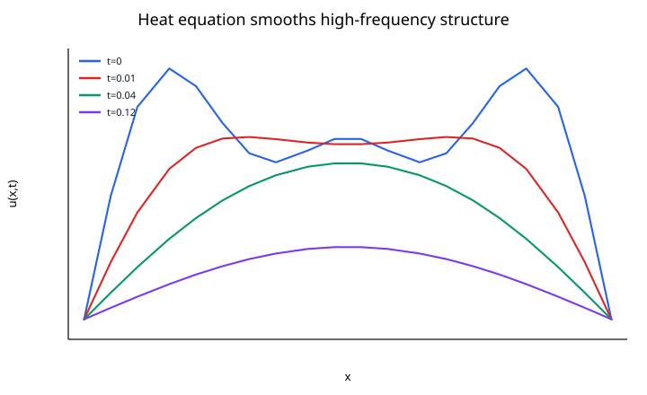
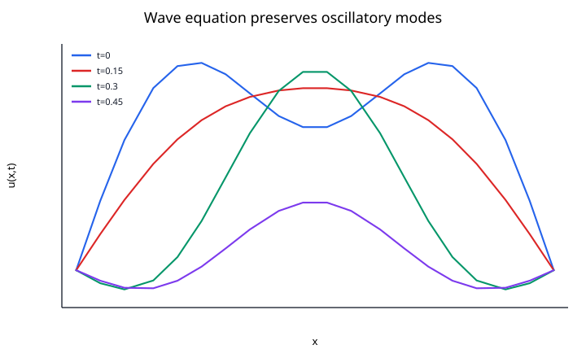

## Partial Differential Equations

A **partial differential equation (PDE)** relates an unknown function of several independent variables to its partial derivatives. PDEs describe fields rather than single trajectories: temperature in space and time, pressure in a fluid, displacement in an elastic body, or the amplitude of a wave.

A general PDE can be written schematically as

$$
F\left(
\mathbf{x},
t,
u,
\nabla u,
\nabla^2 u,
\ldots
\right)=0.
$$

Here $\mathbf{x}$ denotes one or more spatial coordinates and $t$ may represent time.

### Why PDEs Differ from ODEs

For an ODE, specifying enough initial data often determines a trajectory. A PDE also needs information about the spatial domain and its boundary.

For a domain $\Omega$, typical boundary conditions include:

**Dirichlet**

$$
u=g
\qquad
\text{on } \partial\Omega.
$$

**Neumann**

$$
\frac{\partial u}{\partial n}=g
\qquad
\text{on } \partial\Omega.
$$

**Robin**

$$
\alpha u
+
\beta\frac{\partial u}{\partial n}
=
g
\qquad
\text{on } \partial\Omega.
$$

Time-dependent PDEs also require initial data, such as

$$
u(\mathbf{x},0)=u_0(\mathbf{x}).
$$

### Three Classical Types

For a second-order linear PDE in two variables,

$$
A u_{xx}+2B u_{xy}+C u_{yy}
+\text{lower-order terms}
=
g,
$$

the sign of

$$
B^2-AC
$$

provides the classical classification.

#### Elliptic

If

$$
B^2-AC<0,
$$

the PDE is elliptic.

Prototype:

$$
\nabla^2u=0.
$$

Elliptic problems often describe equilibrium states, such as steady temperature or electrostatic potential.

#### Parabolic

If

$$
B^2-AC=0,
$$

the PDE is parabolic.

Prototype:

$$
u_t=\alpha u_{xx}.
$$

This is the heat equation. It smooths spatial variation as time passes.



#### Hyperbolic

If

$$
B^2-AC>0,
$$

the PDE is hyperbolic.

Prototype:

$$
u_{tt}=c^2u_{xx}.
$$

This is the wave equation. It propagates disturbances at finite speed.



### The Heat Equation

Consider a rod $0\le x\le L$:

$$
u_t=\alpha u_{xx}.
$$

A typical initial-boundary value problem is

$$
u(x,0)=u_0(x),
$$

$$
u(0,t)=u(L,t)=0.
$$

The coefficient $\alpha>0$ is the diffusivity.

For the Fourier mode

$$
u_0(x)=\sin\left(\frac{\pi x}{L}\right),
$$

the exact solution is

$$
u(x,t)
=
e^{-\alpha(\pi/L)^2t}
\sin\left(\frac{\pi x}{L}\right).
$$

Higher-frequency modes decay faster because their second derivatives are larger. This is the mathematical reason diffusion smooths sharp spatial variation.

### The Wave Equation

For a vibrating string,

$$
u_{tt}=c^2u_{xx},
$$

where $c$ is the wave speed.

Two initial conditions are required:

$$
u(x,0)=u_0(x),
$$

$$
u_t(x,0)=v_0(x).
$$

With fixed ends,

$$
u(0,t)=u(L,t)=0.
$$

The solution can be decomposed into normal modes. Unlike the heat equation, the ideal wave equation does not damp those modes; energy oscillates between kinetic and potential forms.

### Laplace and Poisson Equations

Laplace's equation is

$$
\nabla^2u=0.
$$

Poisson's equation adds a source:

$$
-\nabla^2u=f.
$$

These equations occur in electrostatics, steady heat conduction, gravity, and potential flow.

For elliptic equations, boundary values influence the solution throughout the domain. There is no preferred time direction because time is absent from the model.

### First-Order Transport

A simple transport equation is

$$
u_t+c u_x=0.
$$

Its exact solution is

$$
u(x,t)=u_0(x-ct),
$$

so the initial profile moves with speed $c$ without changing shape.

This equation highlights the importance of numerical conservation and numerical diffusion: a poor discretization may artificially smear or oscillate around a transported profile.

### Method of Lines

A common way to solve time-dependent PDEs numerically is to discretize space first.

For the heat equation, use grid points $x_j=j\Delta x$ and the centered difference

$$
u_{xx}(x_j,t)
\approx
\frac{u_{j-1}-2u_j+u_{j+1}}{\Delta x^2}.
$$

Then the PDE becomes a system of ODEs:

$$
\frac{du_j}{dt}
=
\alpha
\frac{u_{j-1}-2u_j+u_{j+1}}{\Delta x^2}.
$$

An ODE solver can then integrate this system in time. This is the **method of lines**.

### Stability of a Simple Heat Solver

If forward Euler is used in time together with centered differences in space,

$$
u_j^{n+1}
=
u_j^n
+
r
\left(
u_{j-1}^n
-2u_j^n
+u_{j+1}^n
\right),
$$

where

$$
r=\frac{\alpha\Delta t}{\Delta x^2}.
$$

In one spatial dimension, stability requires

$$
r\le\frac{1}{2}.
$$

This is a typical **CFL-type restriction**: refining the spatial grid may force a much smaller time step.

### Main Numerical Approaches

#### Finite Differences

Replace derivatives with differences on a grid. Finite differences are simple and effective on regular geometries.

#### Finite Volumes

Integrate conservation laws over small control volumes and update fluxes across their boundaries. This is particularly natural for fluid dynamics and conservation laws.

#### Finite Elements

Approximate the solution by basis functions on a mesh and enforce a weak form of the PDE. Finite elements handle irregular geometries and variable material properties well.

#### Spectral Methods

Approximate the solution using global basis functions such as Fourier or Chebyshev modes. For smooth problems, spectral methods can converge extremely rapidly.

### Nonlinear PDEs

Many important PDEs are nonlinear. Examples include:

**Burgers' equation**

$$
u_t+u u_x=\nu u_{xx}.
$$

**Reaction-diffusion**

$$
u_t=D\nabla^2u+R(u).
$$

**Incompressible Navier--Stokes**

$$
\frac{\partial\mathbf{v}}{\partial t}
+
(\mathbf{v}\cdot\nabla)\mathbf{v}
=
-\frac{1}{\rho}\nabla p
+
\nu\nabla^2\mathbf{v}
+
\mathbf{f},
$$

$$
\nabla\cdot\mathbf{v}=0.
$$

Nonlinearity can introduce shocks, bifurcations, turbulence, and pattern formation.

### A Practical PDE Workflow

1. identify the PDE type and physical domain,
2. state initial and boundary conditions clearly,
3. choose a spatial discretization suited to the geometry and conservation properties,
4. choose a stable time integrator if the problem evolves in time,
5. refine the mesh and time step to check convergence,
6. monitor conserved or dissipated quantities when the model supplies them,
7. distinguish numerical artifacts from genuine model behavior.

### Reproducing the Figures

Run:

```bash
python notes/7_ordinary_differential_equations/resources/plot_partial_differential_equations.py
```
