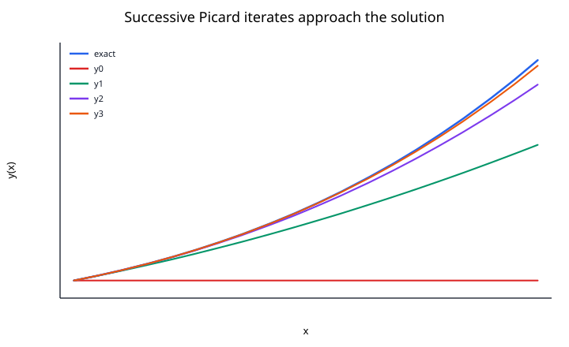
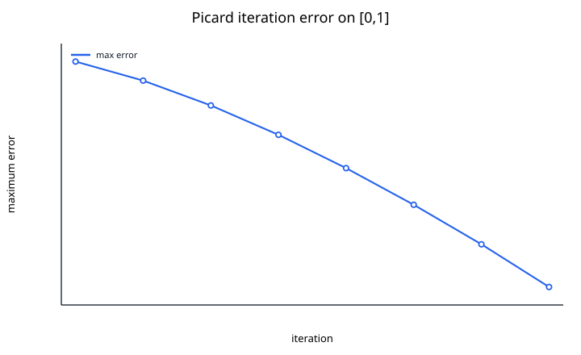

## Picard's Iteration Method

Picard iteration turns an initial value problem into a sequence of integral approximations. It is important less as a production ODE solver than as the constructive idea behind a fundamental existence-and-uniqueness theorem.

Consider

$$
y'(t)=f(t,y(t)),
\qquad
y(t_0)=y_0.
$$

Integrating from $t_0$ to $t$ gives the equivalent integral equation

$$
y(t)
=
y_0
+
\int_{t_0}^{t}
f(s,y(s))\,ds.
$$

Picard's method replaces the unknown function inside the integral with the previous approximation.

### Picard Iteration

Choose an initial function, often

$$
y_0(t)=y_0.
$$

Then define

$$
y_{n+1}(t)
=
y_0
+
\int_{t_0}^{t}
f(s,y_n(s))\,ds.
$$

Each iteration produces a new function, not merely a single number.



### Fixed-Point Interpretation

Define an operator

$$
(Ty)(t)
=
y_0
+
\int_{t_0}^{t}
f(s,y(s))\,ds.
$$

A solution of the IVP is exactly a fixed point:

$$
Ty=y.
$$

Picard iteration is therefore the fixed-point iteration

$$
y_{n+1}=Ty_n.
$$

If $T$ is a contraction on a suitable function space, the contraction mapping theorem guarantees convergence to a unique fixed point.

### Why the Lipschitz Condition Appears

Suppose

$$
|f(t,y)-f(t,z)|
\le
L|y-z|.
$$

Then on a short interval $|t-t_0|\le a$,

$$
|(Ty)(t)-(Tz)(t)|
\le
\int_{t_0}^{t}
L|y(s)-z(s)|\,ds.
$$

Using the supremum norm,

$$
\|Ty-Tz\|_\infty
\le
La\|y-z\|_\infty.
$$

If

$$
La<1,
$$

then $T$ is a contraction. This is the core idea behind the local Picard--Lindelof theorem.

### Worked Example

Consider

$$
y'=x+y,
\qquad
y(0)=1.
$$

The integral form is

$$
y(x)
=
1+\int_0^x(t+y(t))\,dt.
$$

Start with

$$
y_0(x)=1.
$$

The first iterate is

$$
y_1(x)
=
1+\int_0^x(t+1)\,dt
=
1+x+\frac{x^2}{2}.
$$

The second iterate is

$$
y_2(x)
=
1+\int_0^x
\left(
t+1+t+\frac{t^2}{2}
\right)dt,
$$

so

$$
y_2(x)
=
1+x+x^2+\frac{x^3}{6}.
$$

The third iterate is

$$
y_3(x)
=
1+x+x^2+\frac{x^3}{3}+\frac{x^4}{24}.
$$

The exact solution of

$$
y'-y=x
$$

is

$$
y(x)=2e^x-x-1.
$$

The iterates approach this solution on intervals where the contraction argument applies.



### An Important Distinction

Picard iteration is sometimes described as a numerical method, but a direct implementation can be expensive because every iteration requires a new integral over an entire function.

In practical numerical integration, methods such as Runge--Kutta usually provide better efficiency. Picard iteration remains especially valuable for:

- proving local existence and uniqueness,
- deriving series approximations,
- understanding fixed-point methods,
- motivating iterative schemes for integral and differential equations.

### Numerical Implementation

If the integral cannot be evaluated analytically, choose grid points

$$
t_0<t_1<\cdots<t_m
$$

and approximate

$$
\int_{t_0}^{t_j}f(s,y_n(s))\,ds
$$

with a quadrature rule.

This creates two sources of error:

1. iteration error from stopping after finitely many Picard steps,
2. quadrature error from approximating the integral.

The two errors should not be confused.

### Convergence Caveats

Picard iteration may fail or become inconvenient when:

- $f$ is not Lipschitz in the relevant region,
- the interval is too large for the contraction estimate,
- iterates leave the region where the assumptions hold,
- evaluating the required integrals is difficult,
- the ODE is stiff or highly nonlinear.

A local convergence theorem does not imply that one Picard iteration run converges uniformly over an arbitrarily long interval.

### Reproducing the Figures

Run:

```bash
python notes/7_ordinary_differential_equations/resources/plot_picards_method.py
```
