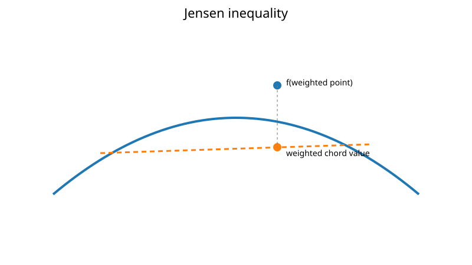
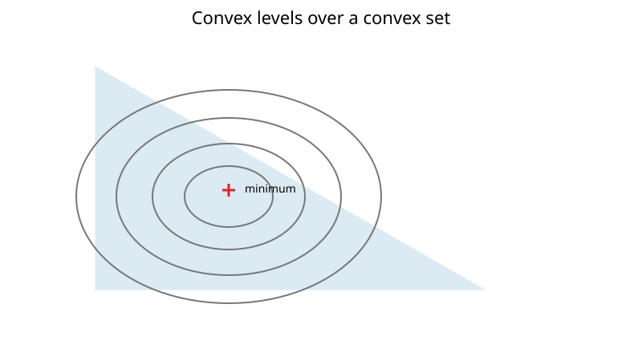

## Convex Optimization

Convex optimization is the best-behaved major class of continuous optimization. Its defining advantage is structural rather than algorithmic:

> For a convex objective over a convex feasible set, every local minimum is global.

That fact turns first-order or KKT conditions into global certificates of optimality.

### Convex sets

A set $C\subseteq\mathbb{R}^n$ is convex if

$$
\theta x+(1-\theta)y\in C
$$

for every $x,y\in C$ and every $\theta\in[0,1]$.

Examples include affine subspaces, half-spaces, Euclidean balls, boxes, and polyhedra.

### Convex functions

A function $f$ is convex when

$$
f(\theta x+(1-\theta)y)
\le
\theta f(x)+(1-\theta)f(y).
$$

Geometrically, the chord between two points on the graph lies above the graph.



For differentiable $f$, convexity is equivalent to the global first-order lower bound

$$
f(y)\ge f(x)+\nabla f(x)^\top(y-x).
$$

For twice-differentiable $f$ on a convex domain, a sufficient and necessary condition is

$$
\nabla^2 f(x)\succeq0
$$

for every $x$ in the domain.

### Strong convexity

A differentiable function is $\mu$-strongly convex if

$$
f(y)\ge f(x)+\nabla f(x)^\top(y-x)+\frac{\mu}{2}\|y-x\|_2^2.
$$

Strong convexity implies a unique minimizer and enables explicit convergence-rate bounds for first-order methods.

### Smoothness and conditioning

If the gradient is $L$-Lipschitz,

$$
\|\nabla f(x)-\nabla f(y)\|_2\le L\|x-y\|_2,
$$

then gradient descent with step $1/L$ satisfies standard convergence guarantees. When $f$ is both $\mu$-strongly convex and $L$-smooth, the ratio

$$
\kappa=\frac{L}{\mu}
$$

plays the role of a condition number.

### Convex constrained problems

A standard convex problem has the form

$$
\min_x f(x)
$$

subject to

$$
g_i(x)\le0,
\qquad Ax=b,
$$

where $f$ and every $g_i$ are convex and the equality constraints are affine.



Under a suitable constraint qualification such as Slater's condition, the KKT conditions are necessary and sufficient for optimality.

### Quadratic programming

A convex quadratic program has objective

$$
q(x)=\frac12 x^\top Qx+c^\top x
$$

with

$$
Q\succeq0.
$$

The repository implementation checks the eigenvalues of $Q$ and then uses a projected-gradient style iteration. See [quadratic programming](quadratic_programming.md) for details.

### Convexity checks in computation

Randomly testing Jensen's inequality at sampled points can find violations, but passing random tests does **not** prove convexity. Analytical structure is preferable:

- known convex atoms and composition rules;
- Hessian positive semidefiniteness;
- epigraph arguments;
- transformations that preserve convexity.

The repository's `is_convex_function` helper should therefore be read as a numerical diagnostic, not a proof.

### Worked example

Consider

$$
f(x,y)=x^2+4y^2+2x-8y.
$$

Its Hessian is

$$
H=
\begin{bmatrix}
2&0\\
0&8
\end{bmatrix}\succ0,
$$

so the function is strongly convex. Setting the gradient to zero gives

$$
2x+2=0,
\qquad
8y-8=0,
$$

hence

$$
(x^*,y^*)=(-1,1).
$$

Because the objective is convex, this stationary point is automatically the unique global minimum.

### Modeling lessons

Before choosing a generic nonlinear solver, ask whether the problem can be expressed as a convex one. A correct convex formulation can transform an apparently difficult search problem into one with global guarantees and reliable numerical methods.

### Reproducing the figures

Run:

```bash
python notes/8_optimization/resources/plot_convex_optimization.py
```
