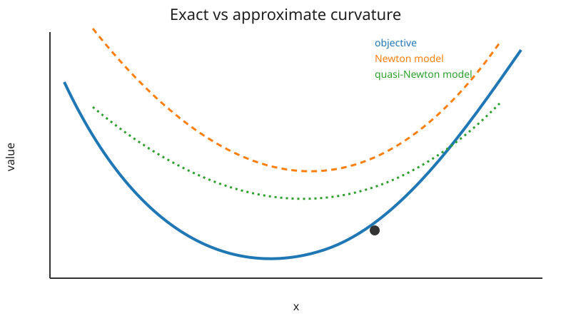

## Newton and Quasi-Newton Methods

Newton-type methods use local curvature to transform the gradient into a better-scaled search direction.

### Newton step

At $x_k$, approximate the objective by its quadratic Taylor model

$$
m_k(p)
=f(x_k)+g_k^\top p+\frac12 p^\top H_kp,
$$

where

$$
g_k=\nabla f(x_k),
\qquad
H_k=\nabla^2 f(x_k).
$$

Setting the gradient of the model to zero gives

$$
H_kp_k=-g_k.
$$

The implementation should solve this linear system; it should not explicitly form $H_k^{-1}$.

### Why Newton can converge quadratically

Near a nondegenerate minimizer, the Hessian changes smoothly and the quadratic model becomes highly accurate. Under standard assumptions,

$$
\|x_{k+1}-x^*\|
\le
C\|x_k-x^*\|^2.
$$

This rapid local convergence is the main attraction of Newton's method.

### Indefinite Hessians

If $H_k$ is indefinite, the Newton direction can satisfy

$$
g_k^\top p_k>0,
$$

meaning it is an ascent direction. Modified Newton methods alter the Hessian or use a trust region to recover a reliable step.

### Quasi-Newton idea

Quasi-Newton methods avoid exact second derivatives. Instead they build a matrix approximation from changes in iterates and gradients:

$$
s_k=x_{k+1}-x_k,
\qquad
y_k=g_{k+1}-g_k.
$$

The secant equation is

$$
B_{k+1}s_k=y_k.
$$

It is the multidimensional analogue of replacing a derivative by a finite secant slope.



### BFGS

For an inverse-Hessian approximation $H_k$, BFGS uses

$$
H_{k+1}
=(I-\rho s y^\top)H_k(I-\rho y s^\top)
+\rho ss^\top,
$$

where

$$
\rho=\frac{1}{y^\top s}.
$$

When $y^\top s>0$, positive definiteness is preserved.

### Cost comparison

For a dense problem with $n$ variables:

- exact Hessian storage costs $O(n^2)$;
- a dense Newton solve costs about $O(n^3)$;
- dense BFGS stores $O(n^2)$ but avoids explicit second derivatives;
- limited-memory BFGS reduces storage to $O(mn)$ using only recent update pairs.

### When to prefer each method

Use Newton when accurate Hessians are affordable and the problem is not too large. Use BFGS when gradients are available but Hessians are inconvenient. For very large problems, prefer sparse Newton-Krylov or limited-memory variants.

### Reproducing the figure

Run:

```bash
python notes/8_optimization/resources/plot_newton_and_quasi_newton.py
```
