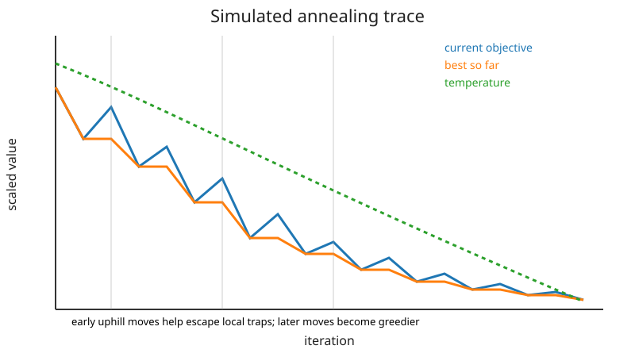

## Simulated Annealing

Simulated annealing is a stochastic global-search method that occasionally accepts worse moves so that it can escape local minima.

### Acceptance rule

Suppose the current point is $x$ and a candidate $y$ has objective difference

$$
\Delta f=f(y)-f(x).
$$

If $\Delta f\le0$, accept the candidate. If $\Delta f>0$, accept with probability

$$
P=\exp\left(-\frac{\Delta f}{T}\right),
$$

where $T>0$ is the temperature.

At high temperature, uphill moves are common. At low temperature, the method becomes increasingly greedy.

### Cooling schedule

The repository uses geometric cooling:

$$
T_{k+1}=\alpha T_k,
\qquad 0<\alpha<1.
$$

The choice of $T_0$, $\alpha$, proposal scale, and iteration budget all matter.



### Proposal distribution

For continuous variables, a simple proposal is

$$
y=x+\sigma z,
\qquad z\sim\mathcal N(0,I).
$$

Candidates are clipped to the box bounds in the repository implementation.

If $\sigma$ is too small, the chain explores slowly. If it is too large, most proposals land in poor regions and are rejected after the temperature cools.

### Best-so-far versus current state

The current state can move uphill, so the algorithm separately tracks the best point seen. This distinction is essential: the final state is not necessarily the best state visited.

### Convergence theory versus practical schedules

Classical convergence proofs require cooling schedules much slower than those used in most practical code. Geometric cooling is popular because it reaches a useful low-temperature regime quickly, but it trades theoretical guarantees for finite-time performance.

### Reproducibility

Because the path is random, report the seed and preferably repeat the run over multiple seeds. For comparisons, summarize distributions of final objective values rather than showing only the best lucky run.

### Reproducing the figure

Run:

```bash
python notes/8_optimization/resources/plot_simulated_annealing.py
```
